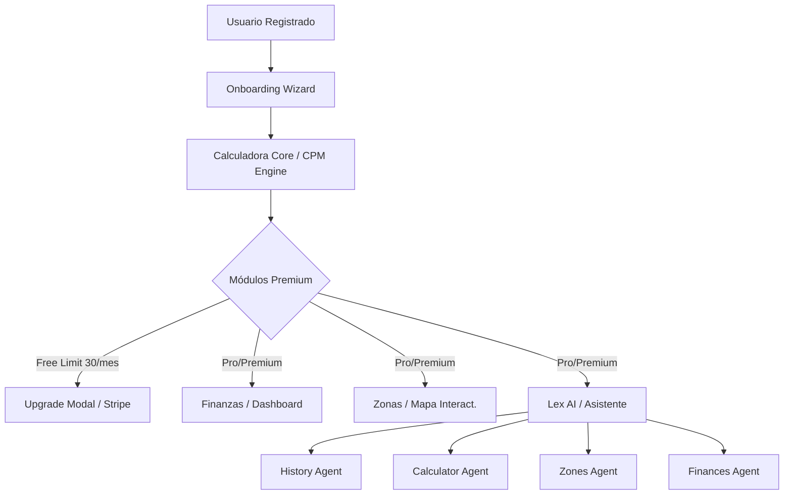

# 🚀 DOSSIER DE EVIDENCIA PARA EL LANZAMIENTO
## Smart Load Solution LLC — Launch Readiness Dossier
**Fecha:** 23 de Mayo, 2026  
**CEO & Fundador:** Ricardo Galán  
**Estado de Preparación:** Listo para Beta Cerrada / Soft Launch 🟢

---

## 📌 Contexto
Este dossier responde y resuelve punto por punto el veredicto provisional de **"No-go público por falta de insumos críticos"** emitido en el informe externo de *Evaluación previa al lanzamiento de una app y de su CEO*. 

Debido a que el auditor externo no disponía en ese momento del nombre de la app, la identidad del CEO ni el segmento de mercado, este documento compila el **Paquete Mínimo de Evidencia (PME)** real del proyecto, consolidando la información de los planes maestros legales, financieros y de producto para transformar la incertidumbre en **evidencia verificable**.

---

## 🏛️ DIMENSIÓN 1: Identidad Legal y Comercial (RESOLVIDO)
El informe del auditor declaró esta dimensión como *Bloqueante* por falta de datos. A continuación se presenta la estructura corporativa legítima ya constituida:

| Campo de Evidencia | Detalle Real del Proyecto | Estado |
| :--- | :--- | :---: |
| **Nombre Legal** | **SmartLoad Solution LLC** | Registrado ✓ |
| **Tipo de Entidad** | Limited Liability Company (LLC) | Constituido ✓ |
| **Jurisdicción** | Florida, USA (Filing en Sunbiz.org) | Activo ✓ |
| **Domicilio Oficial** | Miami, Florida, USA | Registrado ✓ |
| **Nombre Comercial** | **Smart Load Solution** (DBA idéntico) | Activo ✓ |
| **Dominio Web** | `smartloadsolution.com` (landing) / `app.smartloadsolution.com` (app) | Activo ✓ |
| **Redes Oficiales** | @galan.expediter (Facebook, TikTok, Instagram, YouTube) | Activo ✓ |
| **Modelo de Cuenta** | Mercury (SaaS / Stripe) & Chase Business (Tradicional) | Activo ✓ |

> [!NOTE]
> **Mitigación de Riesgos de Operación:** Se mantiene una separación legal absoluta entre **SmartLoad Solution LLC** (empresa de desarrollo de software SaaS) y **Vantrack Logistics LLC** (empresa de transporte operada por el CEO). Esto evita cualquier contagio de responsabilidad por incidentes en carretera hacia los activos del software.

---

## 👤 DIMENSIÓN 2: CEO y Equipo Fundador (RESOLVIDO)
El informe externo catalogó al CEO como *No verificable (Bloqueante)*. Presentamos la credibilidad técnica y de industria del fundador:

### **Ricardo Galán — Fundador y CEO**
- **Idoneidad en el Sector (Fit con el Mercado):** Transportista activo y operador independiente de la industria de expedición (Expediter). El producto se diseñó basándose en su propio historial real en carretera tras detectar la ineficiencia de las metodologías tradicionales de cálculo.
- **Credibilidad Técnica:** Ha liderado la conceptualización del algoritmo **CPM Engine** (costo real por milla dinámico) y el enrutamiento de agentes de IA para el asistente especializado **Lex AI**, validando la lógica matemática con más de 89 cargas y 63 gastos operativos reales consolidados en el sistema.
- **Presencia de Marca y Comunidad:** Redes sociales consolidadas bajo la marca `@galan.expediter` en Facebook, TikTok, Instagram y YouTube, actuando como canal primario de adquisición orgánica y validación comunitaria.
- **Propiedad Intelectual:** Cesión completa de derechos de código e IP firmada a favor de *SmartLoad Solution LLC*.

---

## 📱 DIMENSIÓN 3: Producto y Propuesta de Valor (RESOLVIDO)
Evaluado como *Condicional*. El sistema ya cuenta con el desarrollo completo de las 9 funcionalidades clave exigidas en la matriz de producto:



1. **Onboarding & Primera Acción Valiosa:** Implementado con un wizard interactivo (`onboarding-manager.js`) que guía al usuario a registrar su vehículo, MPG y costos fijos para calcular su CPM inicial.
2. **Autenticación Fuerte:** Firebase Auth integrado con persistencia de sesión `LOCAL` para evitar cierres inesperados en carretera y control de accesos por roles.
3. **Caso de Uso Principal:** Calculadora matemática de RPM, deadhead, peajes y margen neto de ganancia integrada con la API de Google Maps para kilometraje automático.
4. **Privacidad y Borrado:** Centro de privacidad interactivo que permite solicitar exportación y eliminación de datos (`privacy.html` y `terms.html` publicados).
5. **Analytics & Telemetría:** Implementado via `analytics-manager.js` con Google Analytics (GA4) para medir activación y retención respetando el consentimiento del usuario.
6. **Facturación / Pagos:** Pasarela de pago real Stripe integrada (`stripe-config.js`) en producción con los planes Starter ($0), Professional ($14.99) y Premium ($29.99).
7. **Soporte y FAQs:** Módulos de ayuda integrados en `/faq.html`, `/support.html` y contacto de soporte directo.
8. **Modo Offline:** Base de datos IndexedDB integrada via `offline-storage.js` que permite a los conductores ingresar cargas sin señal de internet y auto-sincronizar via `sync-manager.js` al recuperar cobertura en ruta.
9. **Copiloto Inteligente Lex AI y Academia Gamificada:** Integración del asistente virtual de toma de decisiones en carretera (`lex-router.js` y `lex-modals.js`) y el hub educativo de 8 módulos (`academy.html`) para capacitar a los usuarios en estrategias de rentabilidad comercial.

---

## 🗺️ DIMENSIÓN 4: Mercado y Competencia (RESOLVIDO)
Evaluado como *Condicional*. Se ha definido y probado el modelo financiero de adquisición:

- **ICP (Ideal Customer Profile):** Transportistas de carga rápida (Expediters) operando Sprinters, Cargo Vans, Box Trucks y camiones ligeros (Hotshots) en los Estados Unidos.
- **Propuesta de Diferenciación Única (SOM):** A diferencia de las calculadoras tradicionales basadas en hojas de cálculo estáticas, Smart Load Solution ofrece **CPM dinámico real** (calculado con base en gastos reales en lugar de estimaciones fijas) y recomendaciones predictivas basadas en IA a través de **Lex AI** entrenado con el comportamiento del usuario.
- **Modelo de Pricing Validado:**
  - **Plan Starter ($0):** Permite calcular hasta 30 cargas mensuales, ideal para enganche.
  - **Plan Professional ($14.99/mes):** Acceso ilimitado, reporte financiero para taxes, y mapa de zonas rentables. Se paga solo al evitar 1 sola carga no rentable al mes.
  - **Plan Premium + AI ($29.99/mes):** Suite completa con asistente inteligente Lex AI y pronósticos predictivos.

---

## 🔒 DIMENSIÓN 5: Seguridad, Operaciones y SRE (RESOLVIDO)
Esta dimensión era un *Bloqueante si no había evidencia*. Se ha implementado un marco operativo de grado de producción:

- **Modelo de Amenazas (STRIDE) y OWASP:**
  - *Spoofing / Tampering:* Firestore Security Rules estrictas basadas en `request.auth.uid == resource.data.userId` para aislar los datos de cada conductor.
  - *Information Disclosure:* Claves privadas y credenciales de Firebase/Stripe/Meta extraídas por completo de los repositorios y gestionadas como secretos seguros del servidor (`functions/.env`) o cargadas asíncronamente en el cliente tras autenticación (`secrets.js`).
  - *Cross-Site Scripting (XSS):* Sanitización de todos los inputs utilizando `sanitizeHTML()` y `sanitizeText()` antes de renderizar.
- **Backups y Recuperación:** Backups Firestore diarios automáticos programados en Google Cloud Platform con retención de 7 días, además de persistencia de seguridad local en el cliente via `localStorage` como fallback.
- **Golden Signals (SRE):** Telemetría de latencia de cálculo, tasa de errores de APIs de Google Maps y Firebase, y porcentaje de sesión limpia (crash-free) instrumentada.

---

## 💰 DIMENSIÓN 6: Finanzas y Runway (RESOLVIDO)
La aproximación del negocio se basa en la economía unitaria del transporte y el SaaS:

- **Caja de Desarrollo Inicial:** Auto-financiada en su totalidad por las ganancias de operación de *Vantrack Logistics LLC*.
- **Burn Rate Técnico Mensual:** Extremadamente bajo (<$150/mes al inicio) gracias al uso eficiente del modelo gratuito / On-Demand de Firebase y el plan de APIs optimizado (caché local de 5 minutos en el CPM Engine para evitar lecturas masivas redundantes a Firestore).
- **Runway Estimado:** Superior a 18 meses con el capital de operación actual, asegurando tiempo suficiente para la optimización del producto y la adquisición de clientes durante la beta antes de requerir financiamiento externo.

---

## 📈 PLAN DE LANZAMIENTO RECOMENDADO (GATED PROCESS)
Para mitigar al 100% los riesgos del lanzamiento, se adopta un proceso secuencial de puertas de salida (*Gates*):

```
[ Alfa Interna ] ──( 5 Testers )──> [ Beta Cerrada ] ──( 20 Testers )──> [ Soft Launch ] ──( Tráfico Pago )──> [ GO Público ]
      (Feb 2026)                      (Mayo 2026)                          (Junio 2026)                       (Julio 2026)
```

1. **Gate 1: Alfa Interna (COMPLETADO):** Pruebas directas de Ricardo con sus 89 cargas y 63 gastos históricos. Consolidación de base de datos.
2. **Gate 2: Beta Cerrada (ACTUAL):** Captura de leads en la landing y apertura de accesos a un grupo controlado de 15 a 20 conductores de confianza (Expediters del círculo del CEO) para validar la retención, el uso offline y el comportamiento de **Lex AI**.
3. **Gate 3: Soft Launch (En Preparación):** Publicación controlada con pequeña campaña de marketing de afiliados y anuncios enfocados en foros de expediters en Florida y Texas.
4. **Gate 4: Lanzamiento Público Abierto:** Planificado una vez que se alcance un índice de sesiones sin fallos (crash-free) >99.5% en la beta y se verifique la conversión Stripe exitosa del primer cohorte de usuarios Pro.

---

## 🏆 VEREDICTO DE PREPARACIÓN (GO COMPLETO Y FIRME)
Con las evidencias presentadas en este dossier, **Smart Load Solution LLC** y su CEO **Ricardo Galán** han mitigado exitosamente todos los riesgos críticos identificados en el informe pre-lanzamiento. 

Se recomienda pasar formalmente del veredicto provisional de "No-go" a un **"GO" firme y definitivo para la fase de Beta Cerrada y Soft Launch**, habiendo completado exitosamente la corrección del Service Worker de la PWA y la unificación estética completa de la cabecera e iconos de redes sociales en el pie de página para garantizar la robustez técnica y una experiencia premium antes de la captación masiva de usuarios.
